Simple Encryption/Decryption Python Program that lets the user encrypt and decrypt a file using SHA-256
The encrypted file is rename to: filename + "_encrypted" in the same location it was selected from.

log window gives notice to the user of any errors:
-wrong password
-blank password
-mismatching passwords
-no file selected

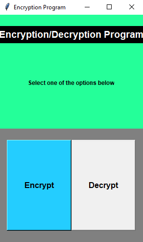 
Main menu at program start, can click on either encrypt or decrypt button

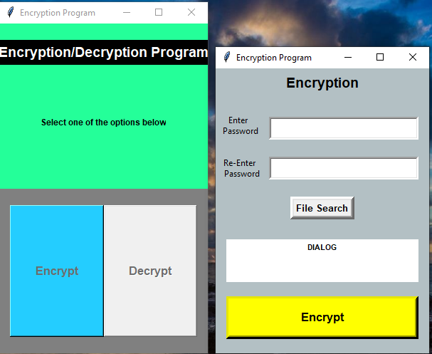 
If a button is clicked a new window pops up which disables the encryption/decryption buttons from the main menu

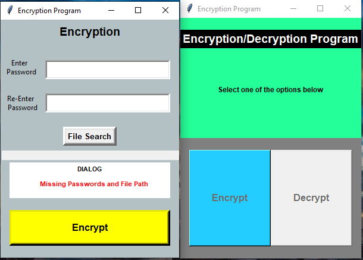 
if the "encrypt" button is clicked without providing password and path to file an error will be printed to the log box

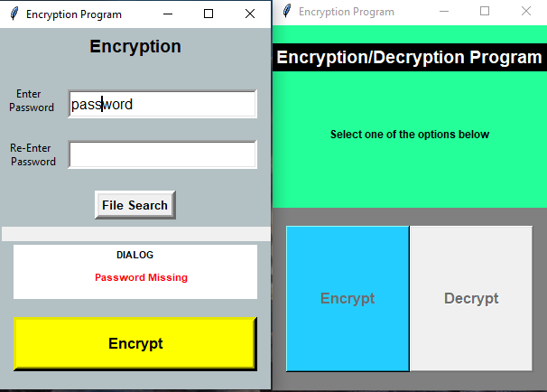 
if the "encrypt" button is clicked without providing the second password and path to file an error will be printed to the log box

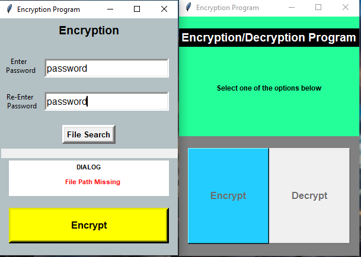 
if the "encrypt" button is clicked without providing the path to file an error will be printed to the log box

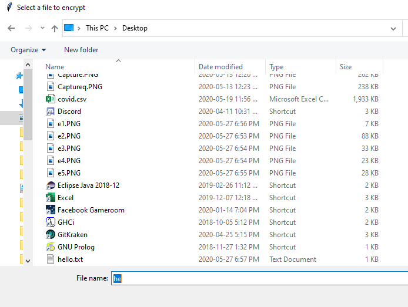 
a select file window will open up if the file button is clicked

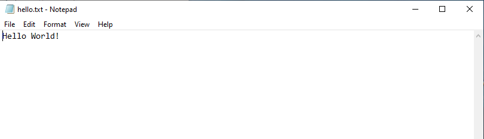 
contents of the text file selected

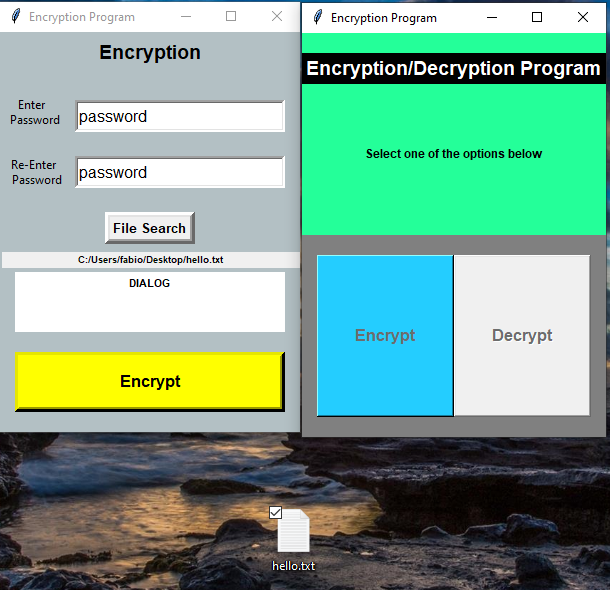 
file path selected

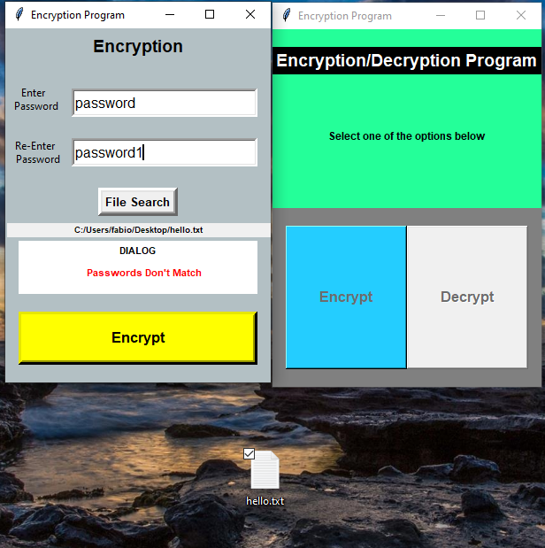 
if the "encrypt" button is clicked and the two paswords mismatch an error will be printed to the log box

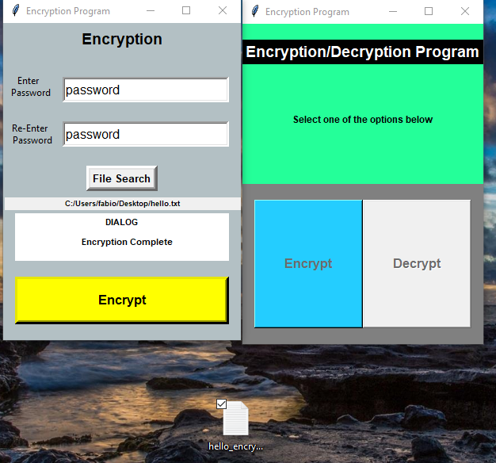 
encryption succesful message
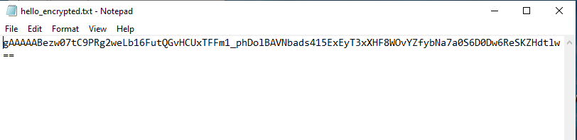 
contents of encrypted file

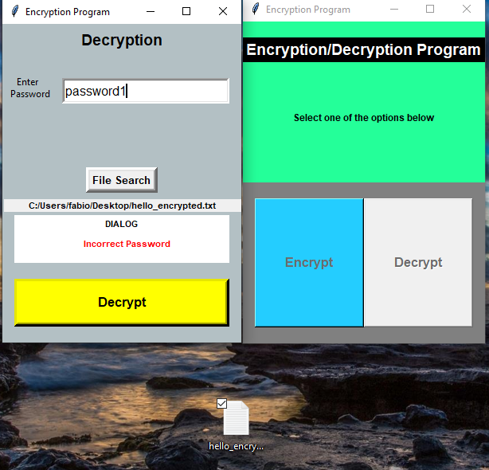 
error message displayed if decryption password doesn't match password used for encryption

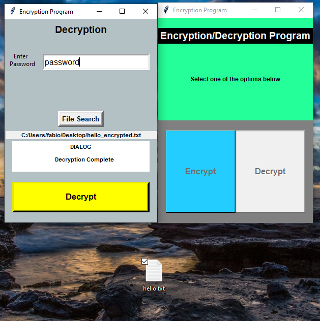 
decryption complete

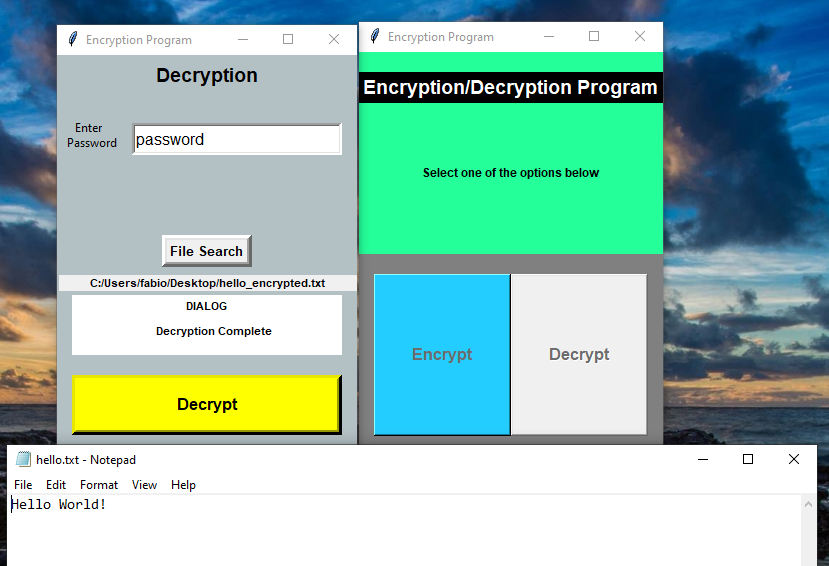 
contents of decrypted file
