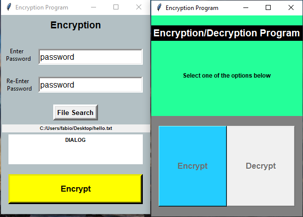

Simple Encryption/Decryption Python Program that lets the user encrypt and decrypt a file using SHA-256
The encrypted file is rename to: filename + "_encrypted" in the same location it was selected from.

log window gives notice to the user of any errors:
-wrong password
-blank password
-mismatching passwords
-no file selected

